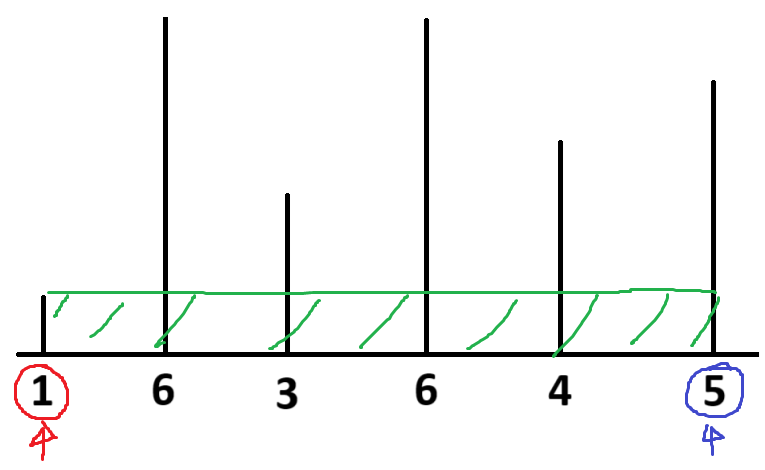
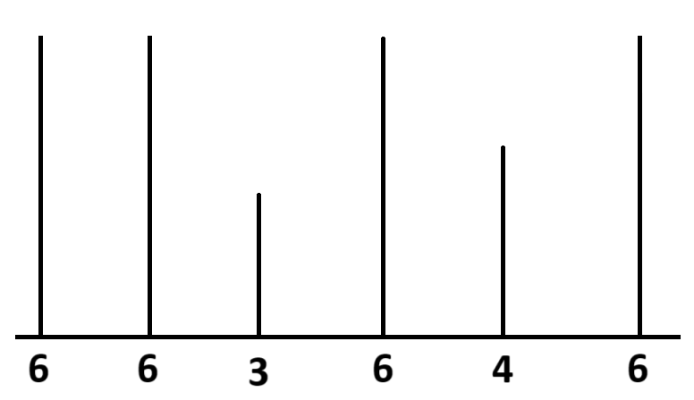
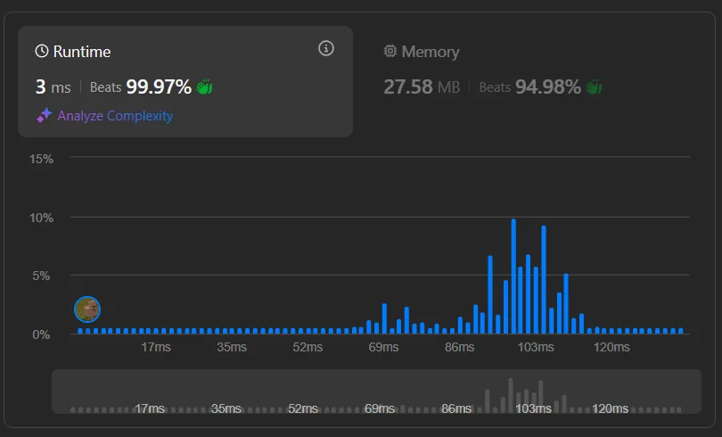

# Container With Most Water

## Learning take-aways

In this task, we started with pointers at each end, maximizing the X-axis value. We then try to improve the smallest of the two - trying to find a value that increases the smallest value of these. It's similar to [853. Car Fleet](/853.%20Car%20Fleet/) or [28. Needle in Haystack](/28.%20Needle%20in%20Haystack/) where you keep iterating to try and find a larger value to improve. The only difference is that here there are two pointers, not one.

## Solving Container With Most Water

We want to maximize the area, meaning we want to maximize the X-distance and height. Start with a base case where we maxmize the X-distance by choosing the first and last height to create an area. From here, we search for a better case by moving away from the smaller height of these two and towards the middle. It's the smaller height that is "limiting" the height we can use for finding the area, and thus from finding a better solution.

> 
>
> No matter where we move the right (blue) pointer, we will always be limited by the height of the left height (height $1$).

If we move the smallest pointer, we at least have a chance to find a larger total area. Continue moving the pointer of the shortest height until the pointers meet, then return the tallest height we have encountered.

## Bonus!

For some reason, in Python, finding the tallest height of the array is really fast. Knowing the tallest height of the array, we can stop iterating over the array way before the two pointers meet. Instead, we can calculate what the theoretically largest area we could potential create with the X value $right - left$ and $height_{max}$ and see if that is greater than the largest area we have already encountered. If it's not, then it's not even theoretically possible to create a better area given the X-value, even in the very best case scenario. Therefore we can stop the search early.

> 
>
> In this example, the first case where the pointers point to the first and last height, is already the largest area which is possible to create. Because we know that $6$ is that tallest height in the array and moving the pointers any closer to the middle will only result in a smaller X-value, and we have already maxmized the height.

[See the python implementation for this approach.](main.py)

