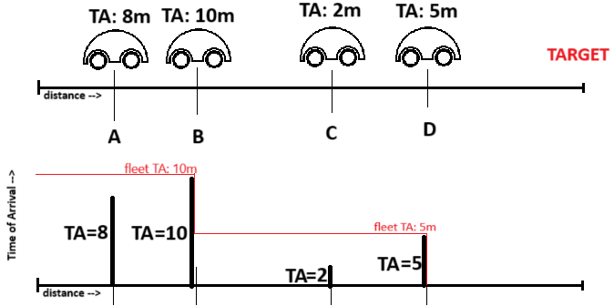

# Car fleet

## Learning take-aways

This task reminded me of [739. Daily temperatures](/739.%20Daily%20Temperatures/), since both tasks look at a sequence of elements and do something different when one number is greater or less than some number that we are tracking. In daily temperatures, we tracked several numbers with a monotonic stack and added to the stack if number was smaller, or popped the stack if it was greater. In this task we tracked the highest time of arrival (TA) and added all cars to the same fleet if their TA was shorter, or created a new fleet if their TA was greater.

TL;DR: Check if a problem can be re-formulated to be a problem that looks at a sequence of data in order, tracks some value and then does something differently depending on if each new value is greater or smaller than the tracked value.

## Solving the task

Instead of looking at the start distance and speed of each car, let's look at the time it would take for each car to get to the goal if there were no other cars on the road (TA - Time of Arrival). We know that if we have two cars $A$ and $B$, where $B$ starts ahead of $A$, then car $A$ will catch up to car $B$ if car $A$'s arrival time is earlier than car $B$.

> 
>
> Car $A$ will catch up to car $B$.

In other words, $B$ will "block" all cars before it that have a time of arrival less than or equal to itself.

Knowing this, we can iterate over all cars, in order of how far away they are from the target, and for each car add all previous cars with a time of arrival less than that car to a fleet (because they all catch up with the car). When we encounter a car that has an arrival time greater than the current fleets arrival time, a new fleet starts with that car and all cars before that car with a shorter arrival time than it.

> 
>
> Iterating over the cars from D to A, we see that $D$ blocks $C$ and they become one fleet. Then we encounter $B$ which has a greater arrival time than $D$ and will therefore never catch up to that fleet. Therefore, $B$ starts a new fleet. This fleet blocks $A$ because $A$ has a shorter arrival time than $B$.

Perhaps this column diagram visualization helps:

