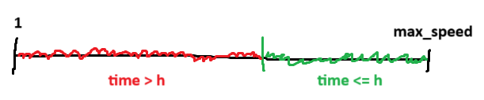

# Koko Eating Bananas

## Learning take-aways

¯\\\_(ツ)\_/¯

## Solving the task

The fastest koko can eat all bananas is in `len(piles)` hours at a speed equal to the biggest pile of bananas. The slowest would be eating 1 banana per second. Somewhere in between these two values, there exists a tipping point where we go from being too slow, given the time constraint $h$, to just fast enough. We need to find that value where koko is just fast enough.

> 
>
> The "tipping point" visualized. Any speed with value in the red range results in a time greater than $h$.

You can calculate the time to eat all bananas in $O(n)$ time:

```py
time = sum(
    math.ceil(pile / speed)
    for pile in piles
)
```

You could search through the speeds like this in linear time $O(n)$, or you could use binary search to find the right speed in $O(log n)$.
